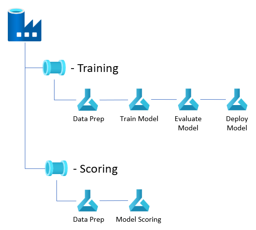
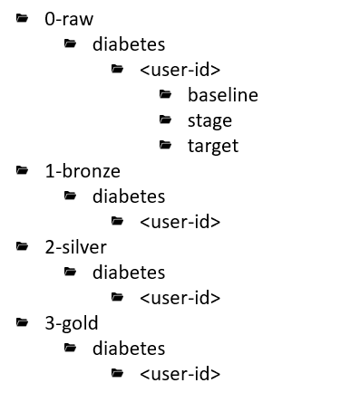

# Azure Machine Learning Workshop 1

## Introduction
This Azure Machine Learning (AML) workshop is based on the [DP100 MSLearn](https://github.com/MicrosoftLearning/mslearn-dp100) lab files. The lab has been tailored to introduce exercises for the learns that require them to reference MS Docs in order to complete TODO's. These TODO's are meant to focus on core components of the AML workspace and Python SDK that will help developers jump start their use of Azure Machine Learning. 

I addition, this workshop introduces exercises for data engineering pipelines in Azure Data Factory (ADF) that are used for training and scoring. Scoring, monitoring, and retraining ML models in production are core activities of [MLOps](https://en.wikipedia.org/wiki/MLOps). This workshop attempts to simplify this rather complex story by focusing on patterns that rely more heavily on Azure Data Factory for orchestration. The presence of DevOps CI/CD is currently omitted from this workshop, with plans of introducing it in the future to support the release of artifacts between environments (i.e. dev, stage, prod).

By the end of this workshop learners will build two ADF pipelines that orchestrate several AML pipelines. The image below helps visualize the scoring and training pipelines you will build in AML that ADF will orchestrate.

The workshop will conclude with an example of the AML data drift feature and how it can be used to determine when the ADF training pipeline should run for retraining the ML model.

## Use Case

The Labs are based on the [Diabetes Dataset](https://www.kaggle.com/mathchi/diabetes-data-set). The lab exercises will have learns build regression models to predict the onset of diabetes in patients.

The lab TODOs will not focus on solving the use case, but rather on learning the AML workspace. The diabetes use case was chosen as a simple well-known scenario in an effort to prevent learns from getting distracted with solving the use case.

## Prerequisites
Before working on the lab modules, there is some environment setup to consider. Below is a list of prerequisite items that typically involve a cloud administrators help.

- Access to an AML workspace with permission to create compute and register datastores.
- Permission to turn on MSI for AML Compute Clusters.
- Creation of a Service Principal for AML workspace access to Azure Data Lake (ADLS)
- Full access to an ADLS container (RBAC - Storage Blob Data Contributor) or directory (POSIX - rwx)
- Azure Data Factory with line-of-sight to AML workspace.
- Execute Python Imports script on environment where notebooks will be executed. Install/Update any missing libraries.
- Clone to workshop repository https://github.com/samleung314/mslearn-dp100.git in the environment that you will run the notebooks.

### Permission Prerequisites
These operations require Owner RBAC role on the AML workspace and ADLS.

- Assign AML workspace Read RBAC role to Compute CLuster MSI.
- Assign AML workspace Contributor RBAC role to Azure Data Factory MSI (See Module 4 - Exercise 1).
- Assign Service Principal created for ADLS access RBAC Storage Blob Data Contributor to ADLS.

### Data Lake Prep
- Create a new container for the workshop.
- Create the following folder structure in the new container replacing <user-id> with your lab id.

## Lab Modules
The workshop will consists of four modules that include a varying number of exercises. Completing the modules in order is design to build an understanding of the AML workspace. The following modules focus on building pipelines to train, deploy and score ML models. This is design to leave learners with an understanding of the basic pattern for productionalizing ML models with AML + ADF.

### Module 1: Getting started 

1. [Getting started with notebooks](../code/Get%20Started%20with%20Notebooks.ipynb)

1. [Running Experiments]()

1. [Work with Data]()

1. [Train & Register Models]()

### Module 2: Inferencing/Scoring

1. [Create Real-time Inferencing Service]()

1. [Batch Inference Pipeline]()

### Module 3: Visual Designer

1. [Visual Designer Data Prep Pipeline]()

### Module 4: Retraining Pattern

1. [Connecting Azure Data Factory]()

1. [Data Factory Training Pipeline]() 

1. [Data Factory Scoring Pipeline]()

1. [Data Drift Monitor]()